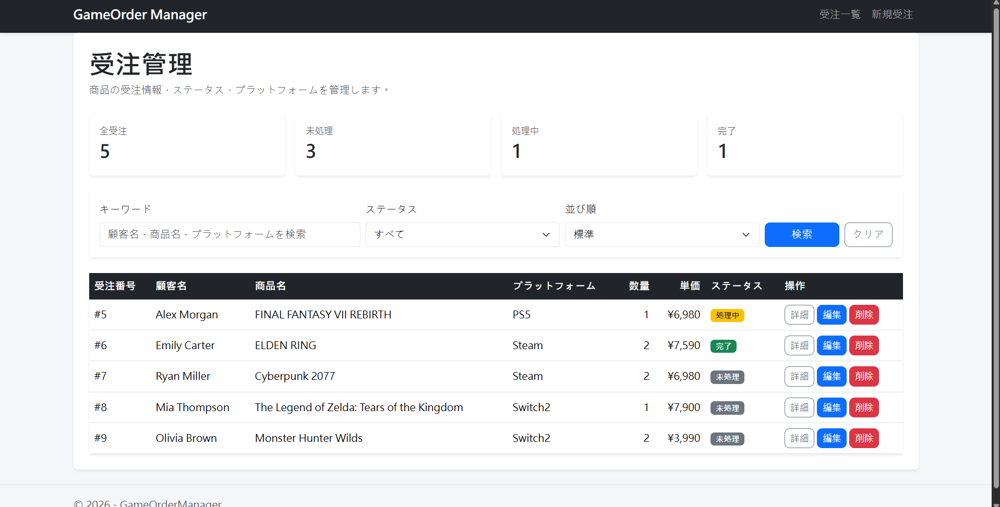
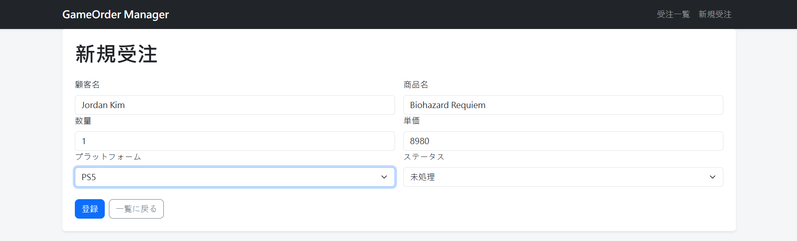
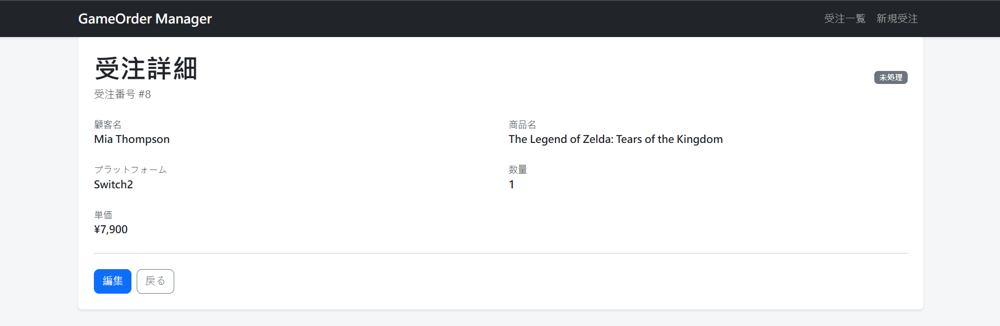

# GameOrderManager

ASP.NET Core MVC と SQL Server を使用して作成した、ゲーム商品の受注管理 Web アプリケーションです。

CRUD 操作を中心に、検索・絞り込み・並び替え・ステータス管理など、
業務システムでよく使用される基本機能を実装しました。

## 画面イメージ

### 受注一覧

### 新規受注

### 受注詳細

## 主な機能

- 受注一覧表示
- 新規受注登録
- 受注内容の編集
- 受注詳細表示
- 受注削除
- 顧客名・商品名・プラットフォームによるキーワード検索
- ステータスによる絞り込み
- 受注番号・数量・単価による並び替え
- ステータス別受注件数の表示
- 入力値のバリデーション

## 使用技術

- C#
- .NET 10
- ASP.NET Core MVC
- Entity Framework Core 10
- SQL Server LocalDB
- Razor
- Bootstrap
- Git / GitHub

## データベース

Entity Framework Core の Migration を使用して、
Model の変更を SQL Server のデータベーススキーマに反映しています。

主なデータ項目：

- 顧客名
- 商品名
- 数量
- 単価
- プラットフォーム
- ステータス

## 開発目的

過去に経験した ASP.NET MVC / SQL Server を復習しながら、
現在の ASP.NET Core MVC と Entity Framework Core を使用して、
Web アプリケーションの基本的なデータ操作や構成を再学習するために作成しました。

特に、単純な CRUD だけでなく、
検索条件の組み合わせや並び替え、データベース Migration など、
業務システムで使用される基本的な処理を意識して実装しています。
